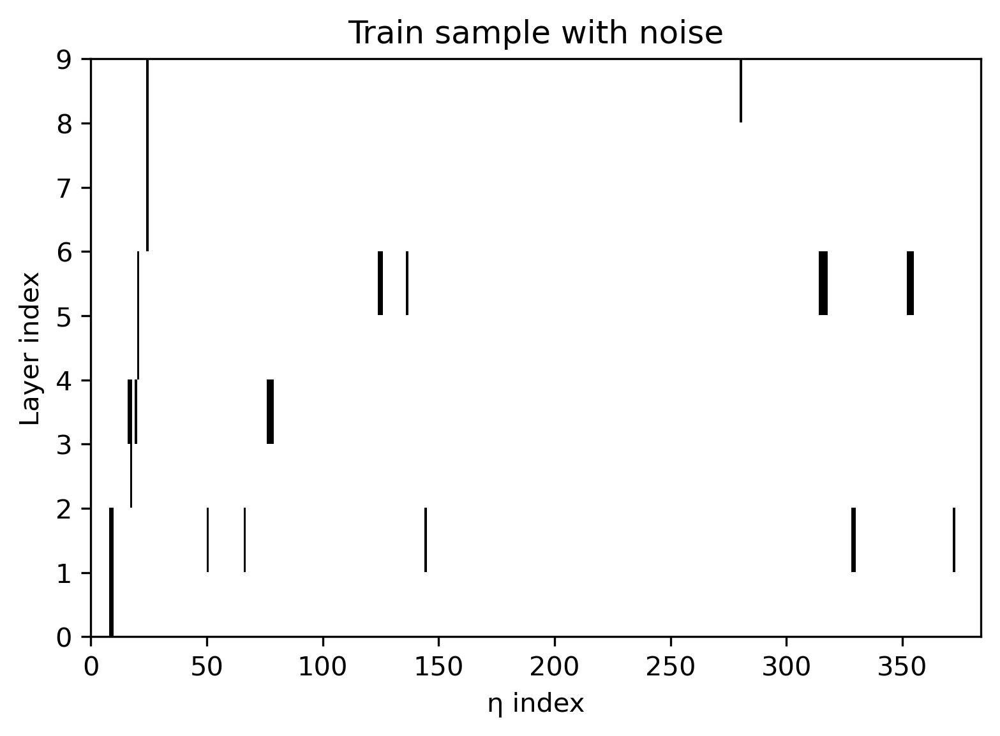
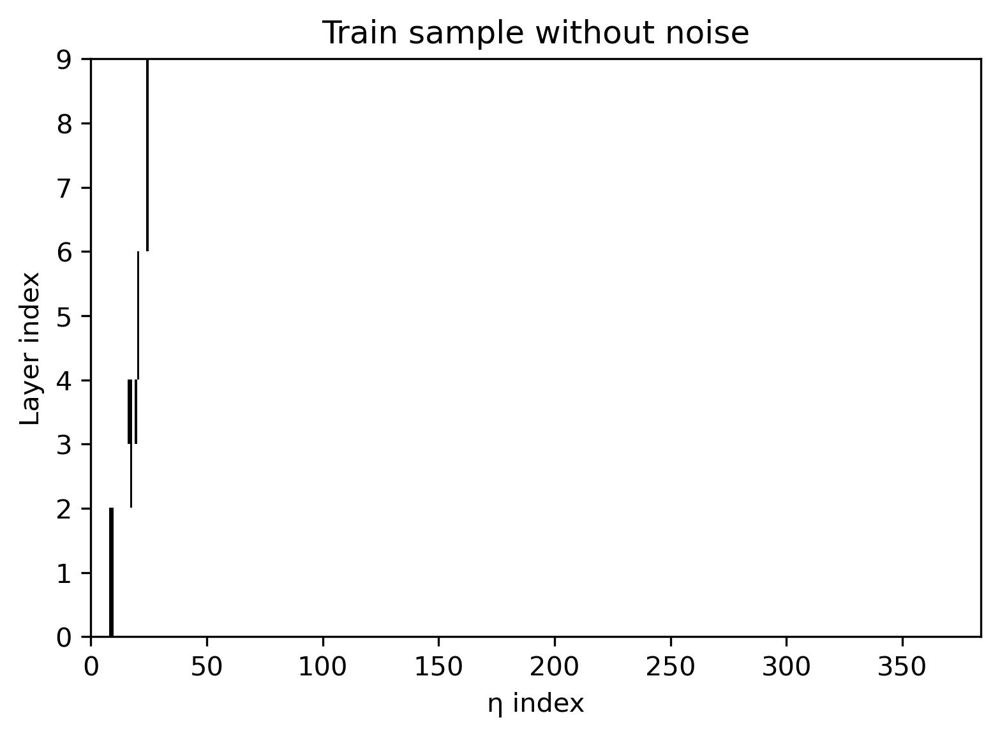
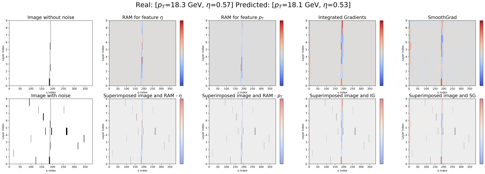
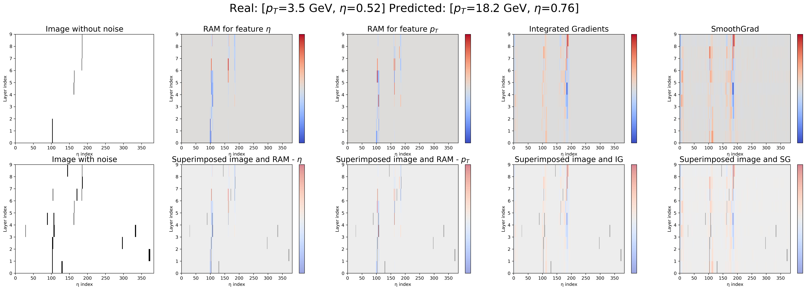
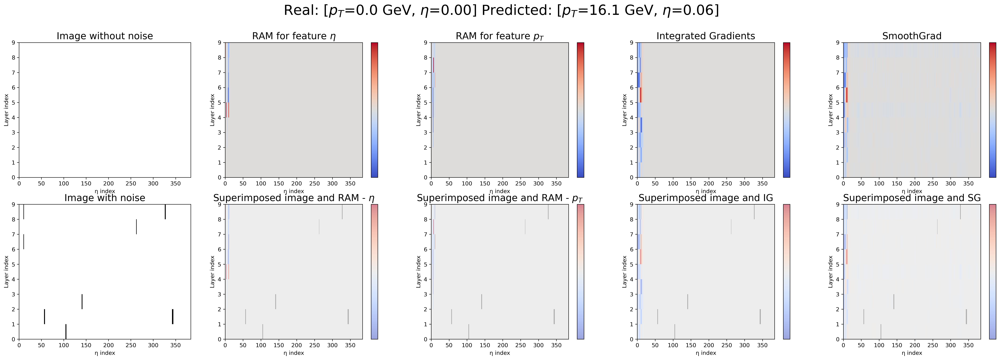
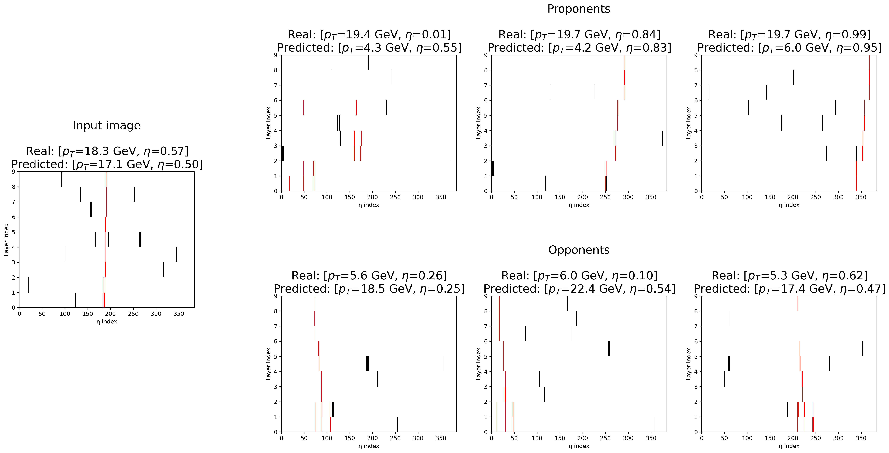
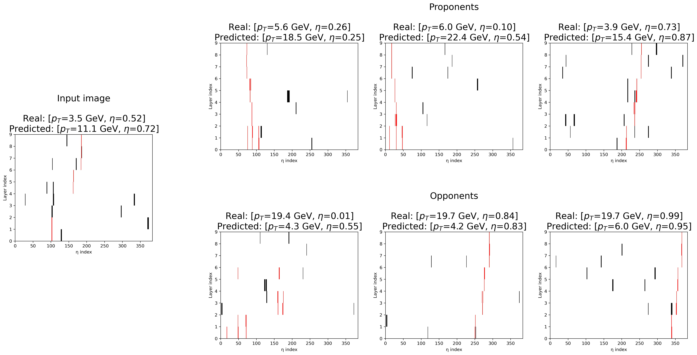
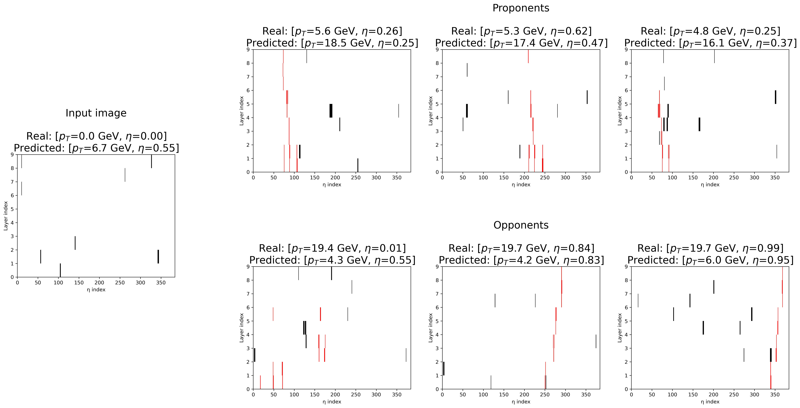

# Convergent approaches to AI Explainability for HEP muonic particles pattern recognition

The main goal of our work is to provide **Explainable Artificial Intelligence (xAI)** techniques to understand model's predictions and decisions. We have developed several techniques for interpretability based on different approaches and explored them in the related notebooks. You can find below a brief description of each method with some results attached therein.

## Dataset

The dataset is composed by binary gray-scaled images representing muonic patterns catched into a detector. They are mainly formed by 0-valued pixels with few lit 1-valued pixels, corresponding to the detected movement of the particle or to noise due to artifacts in the machine.

For instance, a sample image with and without noise is the following:

 

More analysis for data is provided in ```data_analysis.ipynb```.

## xAI techniques

### 1. Attribution methods with Saliency Maps

#### 1.1. Regression Activation Map (RAM)
RAM is the adaptation of *Class Activation Map (CAM)* for regression tasks. It is based on the simple idea to produce heatmaps to graphically visualize which regions in an image mostly affect the predictions of the Convolutional Neural Network model used to solve the task.

#### 1.2. Integrated Gradients (IG)
IG is a method a sequence of interpolated images, from an empty image as baseline to the original one to explain, and computes average of the losses of the gradients to produce a sensitivity map and highlight the most relevant regions in the pictures that have mostly directed the prediction.

#### 1.3. SmoothGrad (SG)
SG is a further extension of saliency-based methods by adding random noise to the image to explain *n* times. This addition should remove the intrinsic noise present in the original image and the generated heatmap should contain general improvements of the visual coherence and sharpness of the consequent explanation.

Here we propose some of the realized results using these three approaches:





More analysis for Attribution methods is provided in ```xai_attribution.ipynb```.

### 2. Convolutional Soft Decision Trees

**ConvSDT** is a hierachical intrinsically-explainable architecture, with convolutional layers on top of a Soft Decision Tree (SDT). A SDT is a variant of the simpler Decision Tree able to perform *soft* decisions: it considers every path from the root to the leaf and weights the predictions of the leaves according to the probability to reach them. Thanks to its hierarchical structure, the explanations are immediately visualizable.


More analysis for ConvSDT is provided in ```xai_dectree.ipynb```.

### 3. Tracing Gradient Descent

**TracIn** is a method that computes the *influence* of training examples on a specific prediction made by the model by tracing how the gradient loss on the test sample varies during the training process whenever the training examples are utilized.





More analysis for TracIn is provided in ```xai_tracin.ipynb```.

### Convergence of methods

In ```xai_convergence.ipynb```, the user is free to test all these methods on the same input image in order to have *convergent* explanations.

## Authors 
- Lorenzo Nicoletti
- Leandro Maglianella